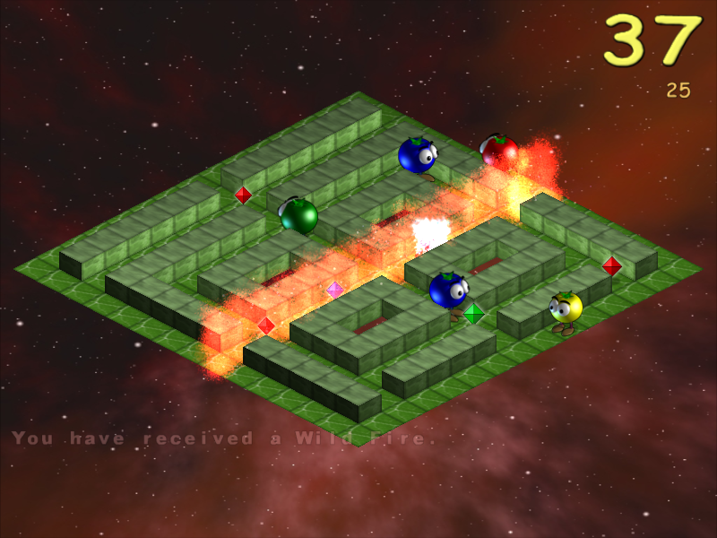
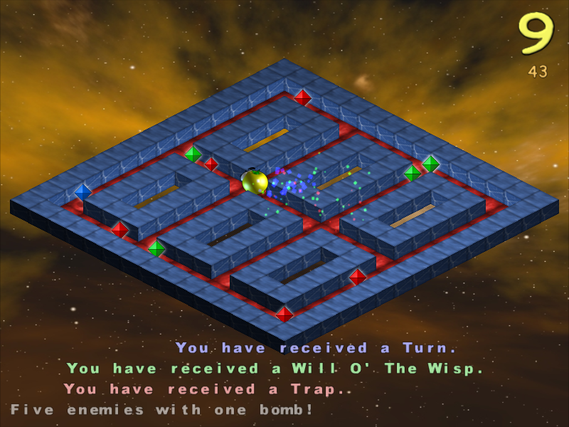

# I Have No Tomatoes
By [Mika Halttunen](https://mhgames.org/)

Forked from Linux source tarball version 1.55

Original website: https://tomatoes.sourceforge.net/




## Changes
* Ported to SDL2
* Game controller support (including analog sticks)
* Re-added the ability to skip background music

## Downloading
[Latest AppImage for Linux amd64](https://github.com/furtarball/tomatoes/releases/latest/download/I_Have_No_Tomatoes-x86_64.AppImage)

To run AppImages, `fuse` must be installed. Refer to [the AppImageKit GitHub page](https://github.com/AppImage/AppImageKit/wiki/FUSE) if problems persist.

Download the file, allow it to be executed and run it:
```
chmod +x I_Have_No_Tomatoes-x86_64.AppImage
./I_Have_No_Tomatoes-x86_64.AppImage
```
Many file managers allow you to do this without opening a terminal.

## Compiling
1. Install dependencies:
* `SDL2-dev`, `SDL2-mixer-dev`, `SDL2-image-dev` (aka `libsdl2-dev`, `libsdl2-mixer-dev`, `libsdl2-image-dev`)
* `mesa-libGLU-dev` (aka `libglu1-mesa-dev` or `glu-dev`)
* `libmodplug` (aka `libmodplug1`)
2. Clone this repository and `cd` into it
3. `make -j$(nproc)`
4. `make portable`
5. Run the compiled game: `I_Have_No_Tomatoes/tomatoes`

Alternatively, you can do `sudo make install` to install it the old-fashioned way. A menu entry will be created.

## Building an AppImage
Prerequisites:
* fuse
* file (the command)
* [linuxdeploy](https://github.com/linuxdeploy/linuxdeploy) and the [AppImage plugin](https://github.com/linuxdeploy/linuxdeploy-plugin-appimage)
```
make -j`nproc` DESTDIR=AppDir
make DESTDIR=AppDir install
linuxdeploy --appdir AppDir --output appimage
```

